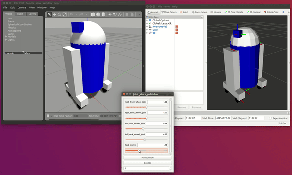

# gazebo_tf_injector



## What is the purpose of gazebo_tf_injector?

Usually, when you want to move a robot in a Gazebo world, you have to attach motors to its joints, set up a controller for each motor, and then tune the controllers.
This package is meant for all who want to move a robot in Gazebo without worrying about the controllers, by simply mimicing the transformations in the ROS transformation tree.
This might be interesting when you already know the poses of the individual robot joints and you want to simulate camera images or laser scans.

## How to use gazebo_tf_injector?

First, make sure [Gazebo](http://gazebosim.org/) and [ROS](http://www.ros.org/)
are installed, as well as the ROS packages that let both of them communicate.
Instructions on how to install them can be found
[here](http://gazebosim.org/tutorials?tut=ros_installing).

Second, build this package, as described in the [ROS tutorials](http://wiki.ros.org/ROS/Tutorials/BuildingPackages).

Finally, launch the [example script](launch/example.launch) that ships with this package:
```bash
roslaunch gazebo_tf_injector example.launch
```

The result looks like the animation at the top of this page.

Lastly, adapt the [example script](launch/example.launch) to your needs.

## How does it all work?

Here is how the example script that ships with this package works.

1. It uploads the robot URDF that also ships with this package to the ROS parameter server.
2. It starts the joint_state_publisher, which reads the robot description from the parameter server and exposes the joint states to the user via a GUI.
3. It launches the robot_state_publisher. This ROS node also reads the robot description from the parameter server. In addition, it listens to the joint states published by the joint_state_publisher and computes the resulting robot link poses. It then publishes these poses to the TF tree.
4. Rviz starts up and visualizes the robot based on the robot description on the ROS parameter server and the transformations published by the robot_state_publisher.
5. Gazebo is started.
6. At last, the launch script executes the script `upload_model`, which is part of the gazebo_tf_injector package. This script executes several steps.
    - It takes the XACRO or URDF description of the robot and converts it to an SDF file. SDF is the format used by Gazebo to describe all kinds of objects. 
    - In the SDF file, the robot is described as a `model`. In Gazebo, models are subject to physics. This is not what we want, because the link poses shall reflect the transformations in the TF tree, and they shall not be altered by gravity or collisions. For this reason, the script transforms the first SDF file into another one, where the robot is an `actor` without joints. 
    - It adds a reference to the library `libgazebo_tf_injector.so` to the SDF file. This library is part of the gazebo_tf_injector package. The reference in the SDF file tells Gazebo to load the plugin library together with the actor.
    - It uploads the second SDF file to Gazebo. Once Gazebo has loaded the plugin, the plugin updates the robot link poses in each simulation step so that they always in sync with the corresponding poses in the ROS TF tree.